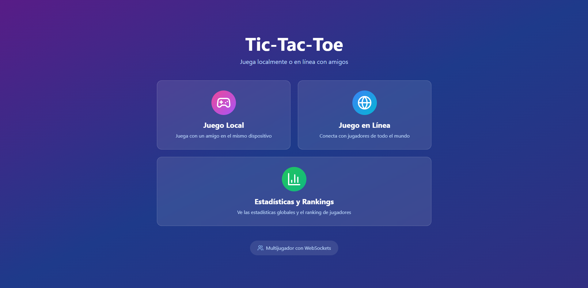
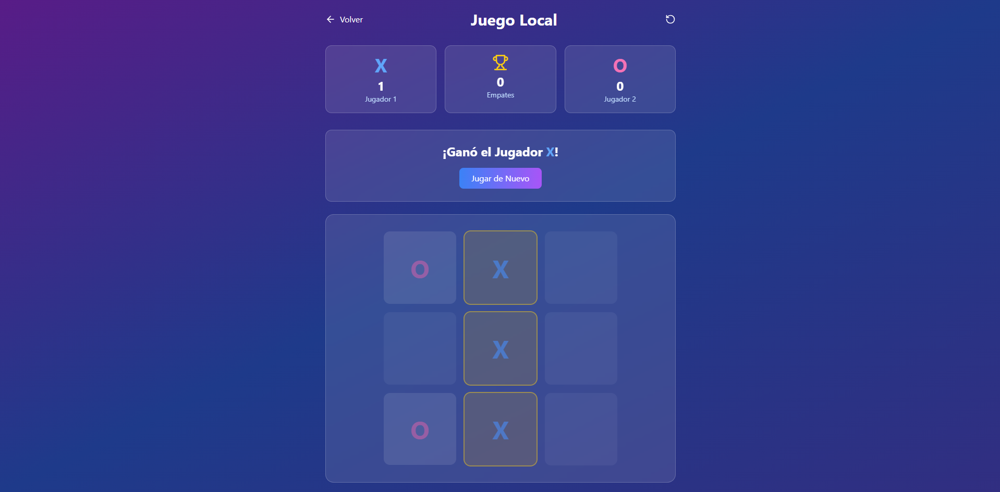
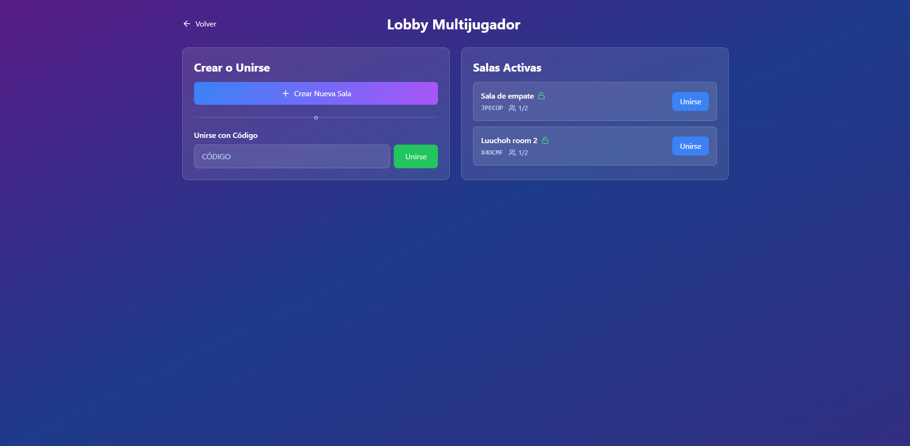
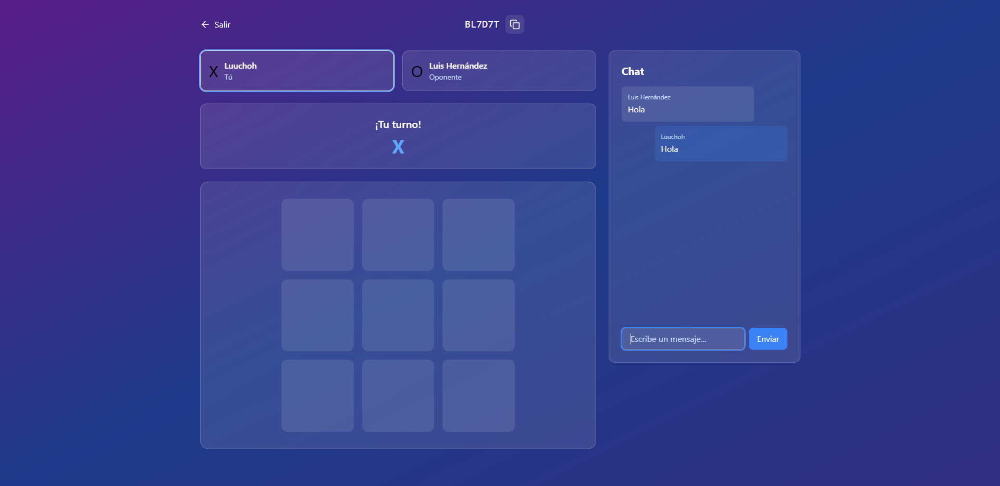
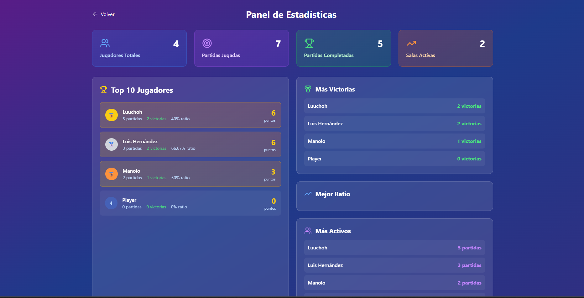

# 🎮 Tic-Tac-Toe Multijugador

Juego de Tres en Línea con funcionalidad multijugador local y en red, usando WebSockets para comunicación en tiempo real y panel administrativo con estadísticas.


## 🛠️ Stack Tecnológico

### Frontend
- **React 18** con Vite
- **Socket.IO Client** para WebSockets
- **Tailwind CSS** para estilos
- **Axios** para peticiones HTTP
- **React Router** para navegación

### Backend
- **Python 3.11+** con FastAPI
- **Socket.IO** para WebSockets
- **PostgreSQL** como base de datos
- **SQLAlchemy** ORM
- **Pydantic** para validación

### DevOps
- **Docker & Docker Compose**

## Inicio


## Juego Local


## Juego Online - Lobby


## Juego Online - Juego


## Ranking


## 📋 Prerequisitos

- Docker y Docker Compose instalados
- Node.js 18+ (para desarrollo local)
- Python 3.11+ (para desarrollo local)

## 🔧 Instalación y Ejecución

### Opción 1: Docker (Recomendado)

```bash
# Clonar el repositorio
git clone <repository-url>
cd tic-tac-toe-multiplayer

# Levantar todos los servicios
docker-compose up --build

# Acceder a:
Frontend: http://localhost:5173
Backend API: http://localhost:8000
API Docs: http://localhost:8000/docs
```

### Opción 2: Desarrollo Local

#### Backend

```bash
cd backend

# Crear entorno virtual
python -m venv venv
source venv/bin/activate  # En Windows: venv\Scripts\activate

# Instalar dependencias
pip install -r requirements.txt

# Configurar variables de entorno
cp .env.example .env
# Editar .env con tus configuraciones

# Iniciar servidor
uvicorn app.main:app
```

#### Frontend

```bash
cd frontend

# Instalar dependencias
npm install
# o
pnpm install
# o
yarn install

# Configurar variables de entorno
cp .env.example .env
# Editar .env con la URL del backend

# Iniciar servidor de desarrollo
npm run dev
# o
pnpm run dev
# o
yarn run dev
```

#### Base de Datos (PostgreSQL)

```bash
# Con Docker
docker run --name postgres-tictactoe \
  -e POSTGRES_PASSWORD=postgres \
  -e POSTGRES_DB=tictactoe \
  -p 5432:5432 \
  -d postgres:15
```


## 🎮 Cómo Jugar

### Modo Local
1. Selecciona "Juego Local" en el menú principal
2. Dos jugadores se turnan en el mismo dispositivo
3. Haz clic en una casilla vacía para marcar
4. El primer jugador en conseguir 3 en línea gana

### Modo Online
1. Crea un nombre de usuario
2. Crea una sala nueva o únete a una existente
3. Comparte el código de sala con tu oponente
4. Espera a que ambos jugadores estén listos
5. ¡Juega en tiempo real!

## 📊 Panel Administrativo

Accede a `/admin` para ver:
- Estadísticas generales del juego
- Ranking de jugadores por victorias
- Historial de partidas
- Jugadores activos en tiempo real
- Gráficos de actividad

## 🔌 API Endpoints

### REST API

```
GET    /api/players              # Lista de jugadores
GET    /api/players/{id}         # Detalle de jugador
POST   /api/players              # Crear jugador
GET    /api/games                # Historial de juegos
GET    /api/games/{id}           # Detalle de juego
GET    /api/rooms                # Salas activas
POST   /api/rooms                # Crear sala
GET    /api/stats/ranking        # Ranking de jugadores
GET    /api/stats/general        # Estadísticas generales
```

### WebSocket Events

**Cliente → Servidor:**
- `join_room` - Unirse a una sala
- `leave_room` - Salir de una sala
- `make_move` - Realizar movimiento
- `ready` - Marcar como listo

**Servidor → Cliente:**
- `room_joined` - Confirmación de entrada
- `game_started` - Juego iniciado
- `move_made` - Movimiento realizado
- `game_over` - Juego terminado
- `player_disconnected` - Jugador desconectado


## 🚀 Deployment

### Con Docker Compose (Producción)

```bash
# Usando docker-compose.prod.yml
docker-compose -f docker-compose.prod.yml up -d

# Ver logs
docker-compose logs -f
```

## 🤝 Contribuciones

1. Fork el proyecto
2. Crea una rama para tu feature (`git checkout -b feature/AmazingFeature`)
3. Commit tus cambios (`git commit -m 'Add some AmazingFeature'`)
4. Push a la rama (`git push origin feature/AmazingFeature`)
5. Abre un Pull Request

## 📝 Licencia

Este proyecto está bajo la Licencia MIT.

## 👥 Autores

- Luis Hernández - Desarrollo Full Stack
